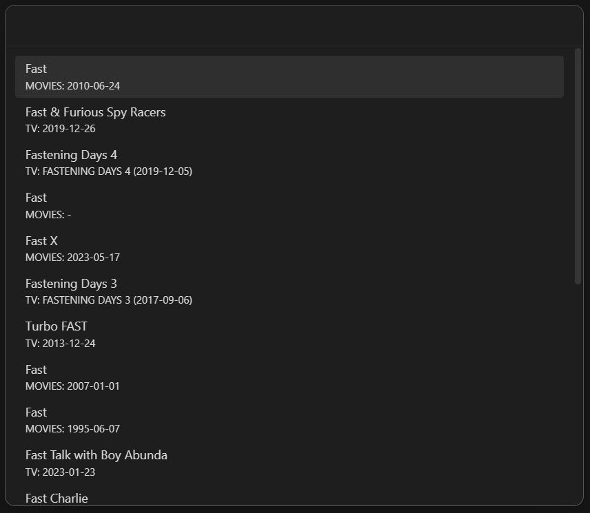
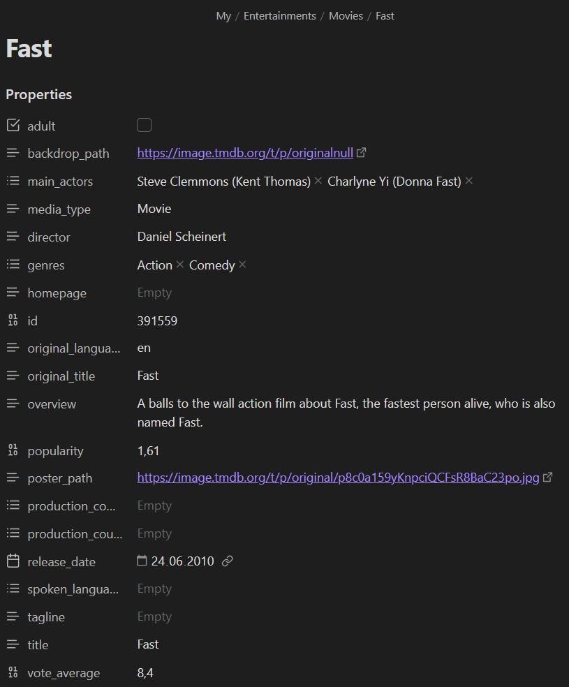
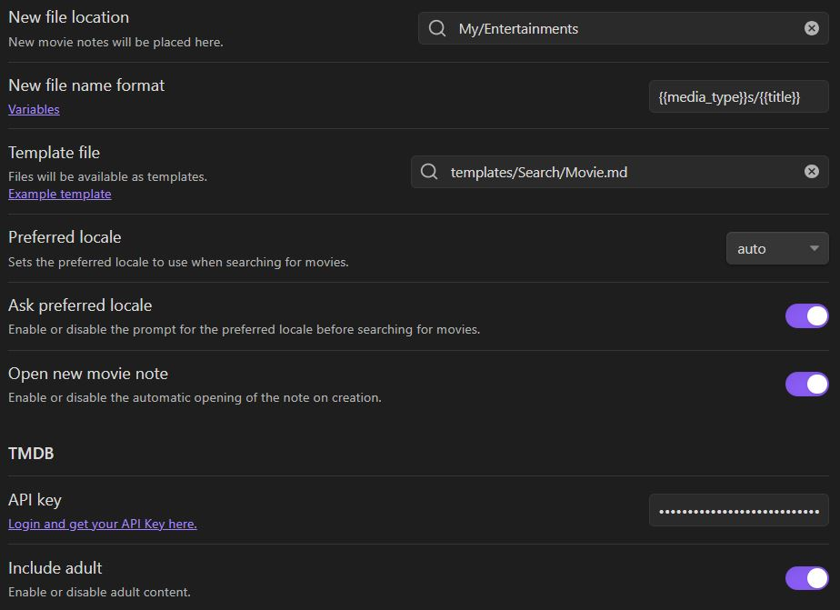

_Easily create movie notes._


[](https://github.com/Gubchik123/obsidian-movie-search-plugin/actions/workflows/pages/pages-build-deployment)

<br>

## Features

-   Flow:
    -   Create a new movie note.
    -   Search for movies by keywords.
    -   Select the movie from the search results.
    -   Get the movie information immediately in the Obsidian note.
-   Settings:
    -   Set the folder location where the new file is created.
    -   Set the template file location.
    -   Set up the services that you use to search for movies.
-   Third-party plugins integration:
    -   Use the [Dataview plugin](https://obsidian.md/plugins?id=dataview) to render the movie notes.
    -   Use the [Templater plugin](https://github.com/SilentVoid13/Templater) with.
-   Advanced:
    -   Enables [Inline scripts](#inline-script) for templates.

<br>

## How to install

### From Community Plugins

Click the link to install the Movie Search plugin: [Install Link](https://obsidian.md/plugins?id=movie-search)

**OR**

Search in the Obsidian Community plugins. And install it.

<p align="center"></p>

### Manually (from GitHub)

<details>
<summary>Steps</summary>
    
1. Clone the repository to your Obsidian plugins folder.

```bash
git clone https://github.com/Gubchik123/obsidian-movie-search-plugin.git
```

2. Install the dependencies.

```bash
yarn install
```

3. Build the plugin.

```bash
yarn build
```

4. Reload Obsidian and enable the plugin in the settings.
 </details>

<br>

## How to use

### 1. Click the ribbon icon (star), or execute the command "Create new movie note".

<p align="center"></p>

### 2. Search for movies by keywords.

<p align="center"></p>

### 3. Select the movie from the search results.

<p align="center"></p>

### 4. Voila! A note has been created.

<p align="center"></p>

<br>

## How to use settings

<p align="center"></p>

<details>
<summary>Options</summary>

### New file location

Set the folder location where the new file is created. Otherwise, a new file is created in the Obsidian Root folder.

### New file name format

Set the format of the new file name. The default is title of the movie.

### Template file

You can set the template file location. There is an example template at the bottom.

### Preferred locale

Set the preferred locale for the movie search. The default is 'auto', which means that the locale is automatically detected by user's query or browser settings.

### Open new movie note

Enable or disable the opening of the new movie note after creation.

### Service Provider

You can set up the services that you use to search for movies. Only TMDB are available now.

#### TMDB API Settings

##### TMDB API Key

Set the API key for TMDB.

> You can get an API key from [developer.themoviedb.org](https://developer.themoviedb.org/reference/intro/authentication).

##### Include adult

Enable or disable the inclusion of adult content in the search results.

</details>

<br>

## Example template

Personally I use the following template to create movie notes ;)

> Please also find a definition of the variables used in this template below (look at: [Template variables definitions](#template-variables-definitions)).

<details>
<summary>templates/Search/Movie.md</summary>

```markdown
---
created: "{{date:DD.MM.YYYY}} {{time:HH:mm}}"
tags:
    - Entertainment
    - {{ media_type }}
status: TO WATCH
cover: "{{poster_path}}"
---

## 📺 -> {{title}}


### 1️⃣ -> Introduction

Title:: {{title}}
Tagline:: {{tagline}}
Release-date:: {{release_date}}
Rating:: {{vote_average}}
Vote-count:: {{vote_count}}

### 2️⃣ -> Summary

[Homepage]({{homepage}})
{{overview}}

### 3️⃣ -> My conclusion

...

#### Score:: 0

### 4️⃣ -> Global Information

Adult:: {{adult}}
Original-title:: {{original_title}}
Original-language:: {{original_language}}
Popularity:: {{popularity}}
Genres:: {{genres}}

Director:: {{director}}
Main-actors:: {{main_actors}}
Production-companies:: {{production_companies}}
Production-countries:: {{production_countries}}
Spoken-languages:: {{spoken_languages}}

### 5️⃣ -> TMDB information

ID:: {{id}}


```

> The idea of the template was taken from the [OB_Template](https://github.com/llZektorll/OB_Template/blob/main/0A_Templates/0A_10_Entertainment/0A_10_2_Movies%26ShowReview.md). Look through the repository for more examples.

</details>

<br>

## Dataview rendering

<p align="center"></p>

Here is the dataview query used in the demo

<details>
<summary>Examples</summary>

### List of watched movies

````
```dataview
TABLE WITHOUT ID
	"" as Cover,
	link(file.link, Title) as Title,
	dateformat(Release-date, "yyyy") as Year,
	Vote-average as "Vote average",
	Original-title as "Org title",
	Score + " / 10" as Score
FROM  "My/Entertainments/Movies" AND #Movie
WHERE status = "WATCHED"
SORT Score DESC, Vote-average DESC, Title ASC
```
````

### List of movies to watch

````
```dataview
TABLE WITHOUT ID
	"" as Cover,
	link(file.link, Title) as Title,
	dateformat(Release-date, "yyyy") as Year,
	Vote-average as "Vote average",
	Original-title as "Org title"
FROM  "My/Entertainments/Movies" AND #Movie
WHERE status = "TO WATCH"
SORT Vote-average DESC, Title ASC
```
````

</details>

<br>

## Template variables definitions

Please find here a definition of the possible variables to be used in your template. Simply write `{{name}}` in your template, and replace name by the desired movie data, including:

<details>
<summary>Table</summary>

| name                 | type    | description                            |
| -------------------- | ------- | -------------------------------------- |
| adult                | boolean | The adult status of the movie.         |
| backdrop_path        | string  | The backdrop image URL of the movie.   |
| main_actors          | string  | The main actors of the movie.          |
| media_type           | string  | It can be 'Movies' or 'TV'.            |
| director             | string  | The director of the movie.             |
| genres               | string  | The genres of the movie.               |
| homepage             | string  | The homepage of the movie.             |
| id                   | integer | The TMDB ID of the movie.              |
| original_language    | string  | The original language of the movie.    |
| original_title       | string  | The original title of the movie.       |
| overview             | string  | The overview of the movie.             |
| popularity           | float   | The popularity of the movie.           |
| poster_path          | string  | The cover image URL of the movie.      |
| production_companies | string  | The production companies of the movie. |
| production_countries | string  | The production countries of the movie. |
| release_date         | string  | The date the movie was published.      |
| spoken_languages     | string  | The spoken languages of the movie.     |
| tagline              | string  | The tagline of the movie.              |
| title                | string  | The title of the movie.                |
| vote_average         | float   | The average vote of the movie.         |
| vote_count           | integer | The vote count of the movie.           |

</details>

<br>

## Advanced

### Inline Script

<details>
<summary>Examples</summary>

#### To print out a movie object:

````
```json
<%=movie%>
```
````

or

````
```json
<%=JSON.stringify(movie, null, 2)%>
```
````

#### When you want to list or link genres:

```
---
Genres: <%=movie.genres.map(genre=>`\n  - ${genre}`).join('')%>
---

Genres: <%=movie.genres.map(genre => `[[Genre/${genre}]]`).join(', ')%>
```

</details>

<br>

## License

[Obsidian Movie Search Plugin](https://github.com/Gubchik123/obsidian-movie-search-plugin) is licensed under the [MIT License](https://github.com/Gubchik123/obsidian-movie-search-plugin/blob/master/LICENSE.md).

<br>

## Contributing

Feel free to contribute.

You can create an [issue](https://github.com/Gubchik123/obsidian-movie-search-plugin/issues/new) to report a bug, suggest an improvement for this plugin, ask a question, etc.

You can make a [pull request](https://github.com/Gubchik123/obsidian-movie-search-plugin/compare) to contribute to this plugin development.

<br>

## Support

If this plugin helped you and you wish to contribute :)

Buy me coffee on [buymeacoffee.com/Gubchik123](https://www.buymeacoffee.com/Gubchik123)

<a href="https://www.buymeacoffee.com/Gubchik123" target="_blank"></a>
